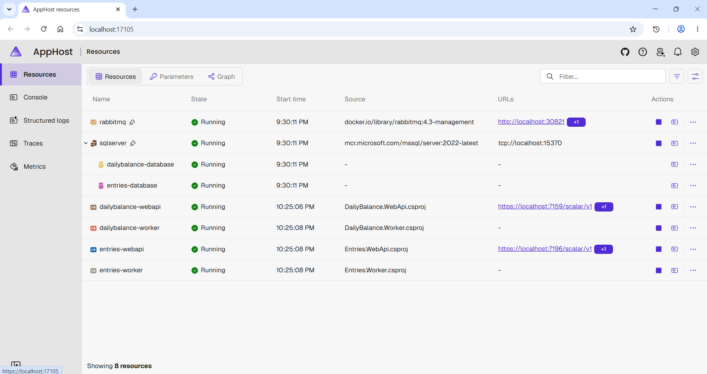

# Desafio Técnico Verity

.NET 10 | C# 14 | Aspire 13 | EF Core 10 | MassTransit + RabbitMQ | xUnit v3

Solução de referência para o **Desafio Técnico Verity**: um sistema de lançamentos financeiros (`Entries`) que publica eventos de integração via **Outbox Pattern** para consolidar o **saldo diário** (`DailyBalance`) em um serviço independente, seguindo **Clean Architecture** e uma abordagem orientada a eventos (Event-Driven).

## Tech Stack

| Camada | Tecnologia |
|-------|-----------|
| **Arquitetura** | Clean Architecture (Domain, Application, Infrastructure, WebApi/Worker) |
| **Runtime** | .NET 10 / C# 14 |
| **API** | Minimal APIs com TypedResults |
| **CQRS** | Handlers manuais — zero dependências, zero risco de licenciamento |
| **Validação** | FluentValidation + Result pattern |
| **Erros** | ProblemDetails (RFC 9457) + tratamento global de exceções |
| **Banco de Dados** | EF Core 10 + SQL Server |
| **Mensageria** | RabbitMQ + MassTransit, com Outbox Pattern para publicação confiável |
| **Autenticação** | API Key (header `X-API-Key`) |
| **Documentação de API** | Scalar (UI moderna para OpenAPI) |
| **Logging** | Serilog (structured logging) |
| **Observabilidade** | .NET Aspire 13 + OpenTelemetry (traces, metrics, logs) |
| **Testes** | xUnit v3 + FluentAssertions + NSubstitute + NetArchTest |
| **Solução** | Formato `.slnx` |

## Arquitetura

O sistema é composto por **dois serviços independentes**, cada um seguindo Clean Architecture e se comunicando de forma assíncrona:

```
┌──────────────────────────────┐          ┌──────────────────────────────┐
│           Entries            │          │         DailyBalance         │
│      (WebApi + Worker)       │          │      (WebApi + Worker)       │
│                              │ RabbitMQ │                              │
│      Recebe e persiste       │ ──────►  │      Consome eventos e       │
│         lançamentos          │          │         consolida o          │
│     (créditos / débitos)     │          │         saldo diário         │
└──────────────────────────────┘          └──────────────────────────────┘

                │                                         │
           depends on                                depends on
                ▼                                         ▼
┌──────────────────────────────┐          ┌──────────────────────────────┐
│    Entries.Infrastructure    │          │ DailyBalance.Infrastructure  │
│ EF Core, Outbox, MassTransit │          │     EF Core, MassTransit     │
└──────────────────────────────┘          └──────────────────────────────┘

                │                                         │
           depends on                                depends on
                ▼                                         ▼
┌──────────────────────────────┐          ┌──────────────────────────────┐
│     Entries.Application      │          │   DailyBalance.Application   │
│  CQRS Handlers, Validators   │          │  CQRS Handlers, Validators   │
└──────────────────────────────┘          └──────────────────────────────┘

                │                                         │
           depends on                                depends on
                ▼                                         ▼
┌──────────────────────────────┐          ┌──────────────────────────────┐
│        Entries.Domain        │          │     DailyBalance.Domain      │
│       Entities, Enums        │          │           Entities           │
└──────────────────────────────┘          └──────────────────────────────┘
```

**Regra de dependência:** cada camada só depende da camada abaixo dela. Domain não possui dependências externas. Testes de arquitetura garantem isso em tempo de build.

**Fluxo de negócio:**
1. O serviço **Entries** recebe um lançamento (`Credit`/`Debit`) via API e o persiste, gravando também uma mensagem na tabela de Outbox.
2. O **Entries.Worker** (`OutboxPublisherWorker`) varre a tabela de Outbox periodicamente e publica os eventos pendentes no RabbitMQ, marcando-os como processados (com retry em caso de falha).
3. O **DailyBalance.Worker** consome o `EntryCreatedEvent` via MassTransit e atualiza o saldo consolidado do dia (crédito, débito e total).
4. O serviço **DailyBalance** expõe uma API para consulta do saldo por data.

## Estrutura do Projeto

```
src/
├── Entries/
│   ├── Entries.Domain/                 # Entidades (Entry, OutboxMessage), Enums (EntryType)
│   ├── Entries.Application/            # CQRS commands/queries, handlers, validators (Features/Entries)
│   ├── Entries.Infrastructure/         # EF Core, Outbox, publicação de eventos (MassTransit)
│   ├── Entries.WebApi/                 # Endpoints Minimal API, Scalar, Program.cs
│   └── Entries.Worker/                 # OutboxPublisherWorker (BackgroundService)
│
├── DailyBalance/
│   ├── DailyBalance.Domain/            # Entidades (Balance, ProcessedEvent)
│   ├── DailyBalance.Application/       # CQRS commands/queries, handlers, validators (Features/Balances)
│   ├── DailyBalance.Infrastructure/    # EF Core, persistência
│   ├── DailyBalance.WebApi/            # Endpoints Minimal API, Scalar, Program.cs
│   └── DailyBalance.Worker/            # Consumers MassTransit (EntryCreatedEventConsumer)
│
├── Shared/
│   ├── Shared.Domain/                  # Abstrações comuns de domínio (Entity, etc.)
│   ├── Shared.Application/             # Abstrações comuns de CQRS (ICommandHandler, IQueryHandler)
│   ├── Shared.Contracts/               # Contratos de integração (IntegrationEvents/EntryCreated)
│   └── Shared.WebApi/                  # Autenticação por API Key, filtros de validação, ProblemDetails
│
└── Aspire/
    ├── AppHost/                        # Orquestração Aspire (SQL Server + RabbitMQ)
    └── ServiceDefaults/                # OpenTelemetry, health checks, resiliência

tests/
├── Entries.Architecture.Tests/         # Testes de regras de dependência (Entries)
├── Entries.Application.UnitTests/      # Testes unitários dos handlers (Entries)
├── DailyBalance.Architecture.Tests/    # Testes de regras de dependência (DailyBalance)
└── DailyBalance.Application.UnitTests/ # Testes unitários dos handlers (DailyBalance)

docs/
├── assets/                             # Recursos usados na documentação
└── architecture-decision-records/      # ADRs

DesafioTecnicoVerity.slnx               # Solução (.slnx)
README.md
```

## Orientações

### Pré-requisitos

- [.NET 10 SDK](https://dotnet.microsoft.com/download/dotnet/10.0)
- [Docker Desktop](https://www.docker.com/products/docker-desktop/) (para os containers do Aspire: SQL Server e RabbitMQ)

### Executando com Aspire (recomendado)

```bash
cd AppHost
dotnet run
```

Isso inicia toda a solução:
- **SQL Server** com os bancos `entries-database` e `dailybalance-database`
- **RabbitMQ** com o plugin de gerenciamento habilitado
- **Entries.WebApi** e **Entries.Worker** (publicação de eventos via Outbox)
- **DailyBalance.WebApi** e **DailyBalance.Worker** (consumo de eventos e consolidação de saldo)
- **Aspire Dashboard** para OpenTelemetry (traces, metrics, logs)

Abra a URL do Aspire Dashboard exibida no console para acompanhar a telemetria.



### Explorando a API

- Navegue até `/scalar/v1` de cada serviço (`Entries.WebApi` e `DailyBalance.WebApi`) para a documentação interativa via Scalar.
- Todos os endpoints exigem autenticação por API Key. Envie o header:
  ```
  X-API-Key: <valor configurado em appsettings>
  ```

### Executando os Testes

```bash
dotnet test DesafioTecnicoVerity.slnx
```

## Endpoints

| Serviço | Endpoint | Método | Auth | Descrição |
|---------|----------|--------|------|------------|
| Entries | `/api/v1/entries` | POST | Sim (API Key) | Cria um novo lançamento (crédito/débito) |
| Entries | `/api/v1/entries/{id}` | GET | Sim (API Key) | Consulta um lançamento por ID |
| DailyBalance | `/api/v1/balances/{date}` | GET | Sim (API Key) | Consulta o saldo consolidado de uma data |

## Decisões de Projeto

Cada decisão de arquitetura relevante é documentada como um Architecture Decision Record (ADR), contendo o
contexto que motivou a decisão, as alternativas consideradas, a decisão tomada e as consequências (positivas
e negativas) dessa escolha.

| ADR | Título | Status |
|-----|--------|--------|
| [0001](docs/architecture-decision-records/0001-dois-servicos-independentes-entries-e-dailybalance.md) | Dois serviços independentes: Entries e DailyBalance | Aceita |
| [0002](docs/architecture-decision-records/0002-orquestracao-local-com-net-aspire.md) | .NET Aspire como orquestrador local de desenvolvimento | Aceita |
| [0003](docs/architecture-decision-records/0003-cqrs-para-separar-comandos-e-consultas.md) | CQRS para separar comandos e consultas | Aceita |
| [0004](docs/architecture-decision-records/0004-autenticacao-via-api-key.md) | Autenticação via API Key (em vez de JWT/OAuth2) | Aceita |
| [0005](docs/architecture-decision-records/0005-outbox-pattern-para-publicacao-confiavel-de-eventos.md) | Outbox Pattern para publicação confiável de eventos | Aceita |
| [0006](docs/architecture-decision-records/0006-idempotencia-e-consistencia-eventual-no-consumo-de-eventos.md) | Idempotência e consistência eventual no consumo de eventos | Aceita |
| [0007](docs/architecture-decision-records/0007-versionamento-de-contratos-de-integracao.md) | Estratégia de versionamento dos contratos de integração (eventos) | Aceita |

## Autor

Desenvolvido por **Rafael Ríspoli** — rispoli.rafael@gmail.com

## Licença

MIT License.
